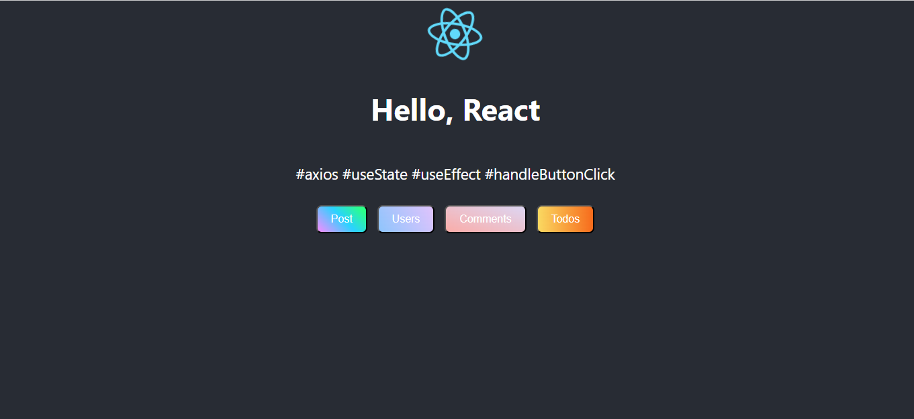

### React Project 1
# {JSON} Placeholder API

#### Bu çalışmada
- {JSON} Placeholder API den veriler aktrıldı.
- Aktarılan veriler butonllarla aktif edildi.
- Butonlara tıklanınca apiden alınan datalar ekrana yansıtıldı.
- veri çekiminde gecikme fonksiyonu işlevsel hale getirildi.

- API link: https://jsonplaceholder.typicode.com/

## Preview

# Getting Started with Create React App

This project was bootstrapped with [Create React App](https://github.com/facebook/create-react-app).

## Available Scripts

In the project directory, you can run:

### `npm start`

Runs the app in the development mode.\
Open [http://localhost:3000](http://localhost:3000) to view it in your browser.

# AxiosApi_ReactProject
